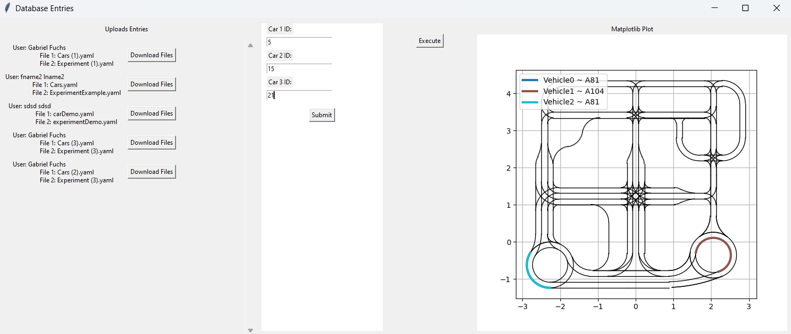

# Local Python App for Experiment Management

This repository contains work related to the local Python application used for running uploaded code from the database as an experiment in the lab. The application facilitates the following:

1. **Experiment Selection**  
   Displays available experiments uploaded to the database, allowing the lab assistant to choose the desired one.

2. **Car ID Assignment**  
   Simplifies assigning car IDs based on which cars are operational or charged (checked manually).

3. **Car Placement Visualization**  
   Provides a visual representation of where to place the cars based on the uploader's design.

4. **Experiment Execution**  
   Includes a button to execute and run the selected experiment.

## Example Image

